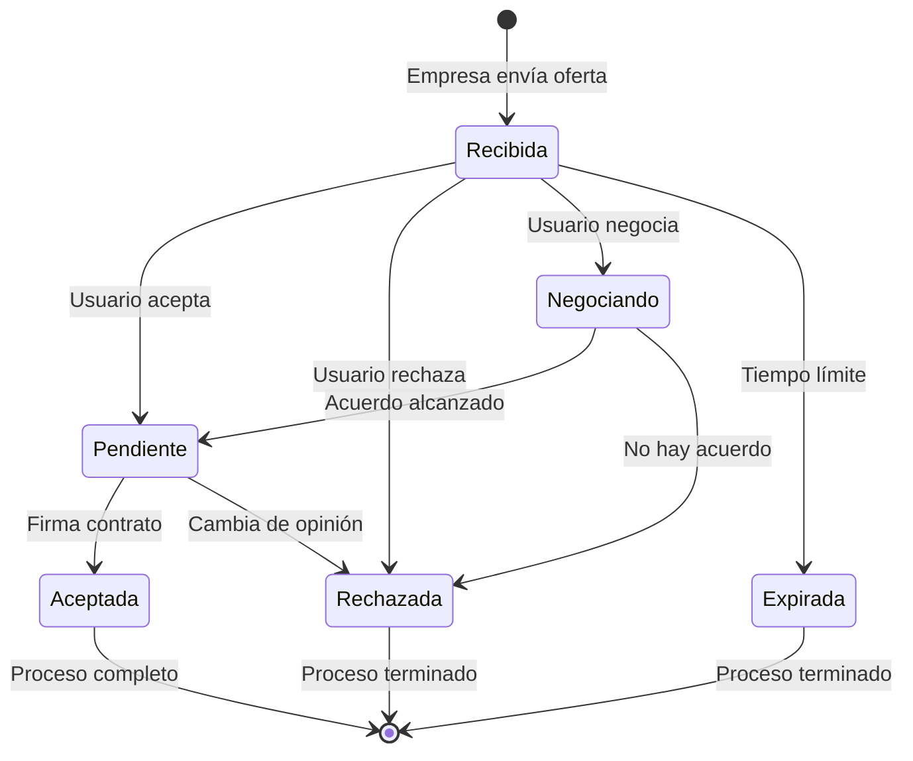

# Aceptación de Ofertas y Compartir Perfil

## 📋 Resumen

Se implementaron dos funcionalidades clave para mejorar la experiencia del candidato:

1. **Sistema de Aceptación de Ofertas** - Los candidatos pueden aceptar, rechazar o negociar ofertas de trabajo
2. **Compartir Perfil** - Los candidatos pueden compartir su perfil con empresas registradas en la plataforma

---

## 1. Sistema de Aceptación de Ofertas

### 🎯 Funcionalidad

Los candidatos ahora pueden gestionar sus ofertas de trabajo con tres acciones principales:

#### Aceptar Oferta
- **Acción**: Cambia el estado de la oferta a `pending` (pendiente)
- **Flujo**:
  1. Usuario hace clic en "Aceptar Oferta"
  2. La oferta se mueve automáticamente a la sección "Pendientes"
  3. Se muestra notificación de éxito con próximos pasos
  4. La empresa es notificada (en producción)

**Mensaje de confirmación**:
```
✅ ¡Oferta aceptada!

La oferta de [Empresa] ha sido movida a "Pendientes".

Próximos pasos:
• La empresa será notificada
• Recibirás el contrato para firma
• Podrás negociar detalles finales
```

#### Rechazar Oferta
- **Acción**: Cambia el estado de la oferta a `declined` (rechazada)
- **Flujo**:
  1. Usuario hace clic en "Rechazar Oferta"
  2. Se muestra confirmación: "¿Estás seguro de que deseas rechazar la oferta de [Empresa]?"
  3. Si confirma, la oferta se marca como rechazada
  4. La empresa es notificada

**Características**:
- Requiere confirmación (no se puede deshacer)
- Feedback háptico de advertencia
- Notificación a la empresa

#### Negociar Oferta
- **Acción**: Cambia el estado de la oferta a `negotiating` (en negociación)
- **Flujo**:
  1. Usuario hace clic en "Negociar"
  2. La oferta se mueve a "En Negociación"
  3. Se muestra mensaje sobre funcionalidad futura

**Mensaje informativo**:
```
💬 Negociación iniciada con [Empresa]

Próximamente:
• Chat en tiempo real con RH
• Propuestas y contrapropuestas
• Historial de negociación
```

### 📊 Estados de Ofertas

| Estado | Descripción | Color | Icono |
|--------|-------------|-------|-------|
| `pending` | Oferta aceptada, esperando contrato | Amarillo | ⏳ |
| `accepted` | Contrato firmado | Verde | ✅ |
| `declined` | Oferta rechazada | Rojo | ❌ |
| `negotiating` | En proceso de negociación | Azul | 💬 |
| `expired` | Oferta expirada | Gris | ⏰ |

### 🎨 UI/UX

**Filtros en la página de Ofertas**:
- Total (todas las ofertas)
- Pendientes (ofertas aceptadas esperando contrato)
- Aceptadas (contratos firmados)
- En Negociación (ofertas siendo negociadas)

**Contador en cada filtro**:
```typescript
const getFilterCount = (status: typeof filter) => {
  if (status === 'all') return offers.length;
  return offers.filter(offer => offer.status === status).length;
};
```

### 💾 Gestión de Estado

```typescript
const [offers, setOffers] = useState<JobOffer[]>(mockJobOffers);

// Actualizar estado de oferta
setOffers(prevOffers => 
  prevOffers.map(offer => 
    offer.id === offerId 
      ? { ...offer, status: 'pending' as const }
      : offer
  )
);
```

---

## 2. Compartir Perfil

### 🎯 Funcionalidad

Los candidatos pueden compartir su perfil profesional con empresas registradas en ClearHire de múltiples formas.

### 🔑 Código de Perfil Único

Cada candidato tiene un código único generado automáticamente:

**Formato**: `CH-[Iniciales]-[Código Aleatorio]`

**Ejemplo**: `CH-MAGA-A7B3C9`

```typescript
const profileCode = `CH-${
  profile.personalInfo.firstName.substring(0, 2).toUpperCase()
}${
  profile.personalInfo.lastName.substring(0, 2).toUpperCase()
}-${
  Math.random().toString(36).substring(2, 8).toUpperCase()
}`;
```

### 🔗 URL Única del Perfil

Cada perfil tiene una URL única basada en el nombre:

**Formato**: `https://clearhire.com/profile/[nombre]-[apellido]`

**Ejemplo**: `https://clearhire.com/profile/maria-garcia`

### 📤 Métodos de Compartir

#### 1. Copiar Enlace
- Copia la URL del perfil al portapapeles
- Feedback visual (icono cambia a check verde)
- Feedback háptico de éxito
- Auto-reset después de 2 segundos

#### 2. Copiar Código
- Copia el código único al portapapeles
- Muestra alerta con instrucciones
- Las empresas pueden buscar por este código

#### 3. Compartir por Email
- Abre cliente de email con plantilla pre-llenada
- Incluye:
  - Nombre completo
  - Especialización
  - URL del perfil
  - Código de perfil
  - Mensaje personalizado

**Plantilla de email**:
```
Hola,

Te comparto mi perfil profesional en ClearHire:

👤 María García
💼 Desarrolladora Full Stack
🔗 https://clearhire.com/profile/maria-garcia
🔑 Código de perfil: CH-MAGA-A7B3C9

Puedes buscarme en ClearHire usando mi nombre o código.

Saludos,
María
```

#### 4. Compartir Nativo (Móvil)
- Usa la API nativa de compartir del dispositivo
- Funciona en iOS, Android y navegadores modernos
- Fallback a modal personalizado si no está disponible

```typescript
if (navigator.share) {
  await navigator.share({
    title: `Perfil de ${nombre}`,
    text: `Mira mi perfil profesional en ClearHire. Código: ${profileCode}`,
    url: profileUrl,
  });
}
```

### 🎨 Componente ShareProfile

**Ubicación**: `src/components/profile/ShareProfile.tsx`

**Características**:
- Diseño con glassmorphism
- Responsive (móvil y desktop)
- Dark mode compatible
- Feedback háptico en todas las acciones
- Modal de fallback para navegadores sin API nativa

**Secciones**:
1. **Header** - Título y descripción
2. **Código de Perfil** - Display del código con botón copiar
3. **Botones de Compartir**:
   - Copiar enlace
   - Enviar por correo
   - Compartir (nativo)
4. **Info Tip** - Explicación sobre privacidad

### 🔒 Privacidad y Seguridad

**Información Pública**:
- Nombre completo
- Especialización/Trade
- Código de perfil
- URL del perfil

**Información Privada** (solo visible después de aceptar oferta):
- Email
- Teléfono
- Dirección
- Referencias

**Nota de Privacidad**:
```
💡 Tip: Las empresas verificadas en ClearHire pueden encontrarte 
buscando tu nombre completo o usando tu código de perfil. 
Tu información de contacto solo se comparte cuando aceptas una oferta.
```

### 📱 Integración en la UI

El componente `ShareProfile` se muestra en la página de perfil:

**Ubicación**: Justo debajo del indicador de completitud, antes del formulario

**Orden visual**:
1. Header con navegación
2. Badge de completitud del perfil
3. **→ Sección de Compartir Perfil** (nuevo)
4. Formulario de perfil

---

## 🎯 Casos de Uso

### Caso 1: Candidato Acepta Oferta
```
1. Usuario recibe oferta de TechCorp
2. Revisa detalles (salario, beneficios)
3. Hace clic en "Aceptar Oferta"
4. Oferta se mueve a "Pendientes"
5. Usuario espera contrato
6. Puede negociar detalles finales
```

### Caso 2: Empresa Busca Candidato
```
1. Reclutador conoce a María García
2. Busca en ClearHire por:
   - Nombre: "María García"
   - O código: "CH-MAGA-A7B3C9"
3. Encuentra perfil público
4. Revisa experiencia y habilidades
5. Envía oferta de trabajo
6. María recibe notificación
```

### Caso 3: Candidato Comparte Perfil
```
1. Usuario completa su perfil
2. Va a la sección "Compartir Perfil"
3. Copia código: CH-MAGA-A7B3C9
4. Envía código a reclutador por LinkedIn
5. Reclutador busca en ClearHire
6. Encuentra perfil y envía oferta
```

---

## 📊 Métricas y Analytics (Futuro)

### Ofertas
- Tasa de aceptación de ofertas
- Tiempo promedio para aceptar/rechazar
- Ofertas en negociación vs aceptadas directamente
- Razones de rechazo (con feedback opcional)

### Compartir Perfil
- Número de veces compartido
- Método más usado (email, link, código)
- Conversión: compartir → oferta recibida
- Empresas que buscan por código vs nombre

---

## 🔄 Flujo de Estados de Oferta



---

## 🚀 Próximas Mejoras

### Ofertas
1. **Chat de Negociación** - Chat en tiempo real con RH
2. **Historial de Negociación** - Ver todas las propuestas y contrapropuestas
3. **Comparador de Ofertas** - Comparar múltiples ofertas lado a lado
4. **Recordatorios** - Notificaciones antes de que expire una oferta
5. **Feedback de Rechazo** - Opción de dar razón al rechazar

### Compartir Perfil
1. **QR Code** - Generar código QR del perfil
2. **Tarjeta Digital** - Tarjeta de presentación digital
3. **Analytics** - Ver quién ha visto tu perfil
4. **Perfil Público Personalizable** - Elegir qué mostrar públicamente
5. **LinkedIn Integration** - Compartir directamente a LinkedIn

---

## 📝 Archivos Modificados/Creados

### Nuevos Archivos
- `src/components/profile/ShareProfile.tsx` - Componente de compartir perfil

### Archivos Modificados
- `src/pages/Offers.tsx` - Sistema de aceptación de ofertas
- `src/pages/Profile.tsx` - Integración de ShareProfile

### Tipos
- `src/types/salary.ts` - Ya incluye estados de ofertas

---

## ✅ Testing

### Casos de Prueba - Ofertas
1. ✅ Aceptar oferta cambia estado a pending
2. ✅ Rechazar oferta requiere confirmación
3. ✅ Negociar oferta cambia estado a negotiating
4. ✅ Filtros muestran conteos correctos
5. ✅ Feedback háptico en todas las acciones

### Casos de Prueba - Compartir Perfil
1. ✅ Copiar enlace funciona
2. ✅ Copiar código funciona
3. ✅ Email se abre con plantilla correcta
4. ✅ Compartir nativo funciona en móvil
5. ✅ Modal fallback funciona en desktop
6. ✅ Código único se genera correctamente

---

**Fecha de implementación**: Diciembre 2025  
**Archivos creados**: 1  
**Archivos modificados**: 2  
**Líneas de código**: ~400 líneas

**Estado**: ✅ Completado y funcional
