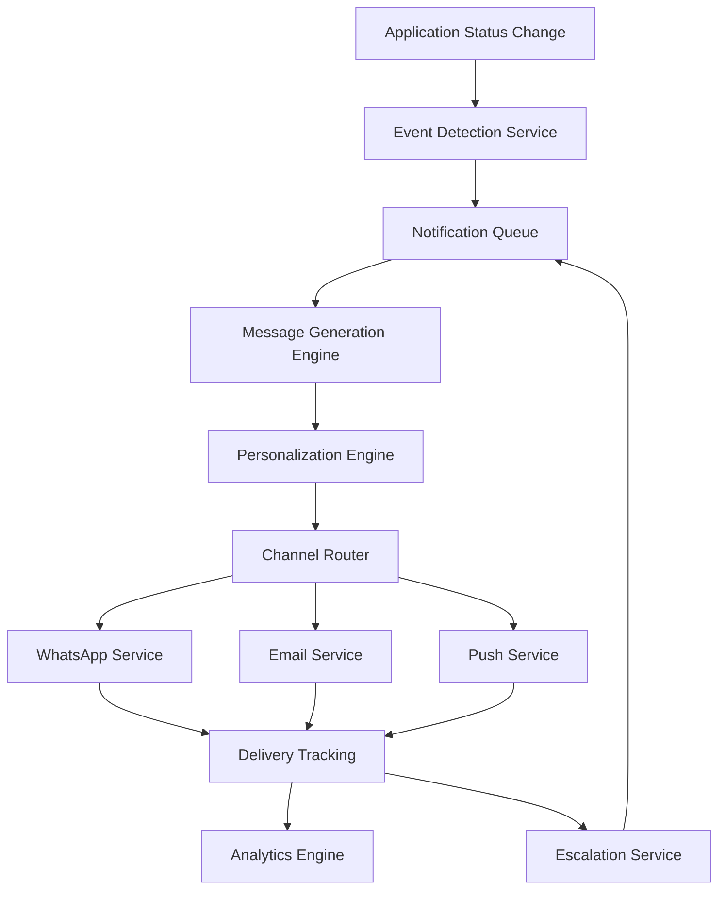

# Design Document - Sistema de Notificaciones Automáticas y Explicativas

## Overview

El Sistema de Notificaciones Automáticas y Explicativas es un componente crítico que garantiza comunicación oportuna, transparente y empática con los candidatos durante todo el proceso de reclutamiento. El sistema implementa una arquitectura event-driven con múltiples canales de entrega, personalización inteligente, y análisis de efectividad para optimizar la experiencia del candidato.

## Architecture

### High-Level Architecture



### Core Components

#### 1. Event Detection Service
- **Purpose**: Detecta cambios de estado en tiempo real
- **Technology**: React Context + Custom Hooks
- **Key Features**:
  - Observer pattern para cambios de estado
  - Debouncing para evitar notificaciones duplicadas
  - Clasificación automática de tipos de cambio

#### 2. Notification Queue
- **Purpose**: Gestiona cola de notificaciones con prioridades
- **Technology**: IndexedDB para persistencia local
- **Key Features**:
  - Sistema de prioridades (alta/media/baja)
  - Reintentos automáticos con backoff exponencial
  - Persistencia offline

#### 3. Message Generation Engine
- **Purpose**: Genera contenido de notificaciones contextual
- **Technology**: Template engine con React components
- **Key Features**:
  - Templates dinámicos por tipo de cambio
  - Soporte multiidioma (ES/PT/EN)
  - Validación de contenido

#### 4. Personalization Engine
- **Purpose**: Personaliza mensajes según perfil del candidato
- **Technology**: Rule-based system con machine learning simulado
- **Key Features**:
  - Análisis de historial del candidato
  - Adaptación de tono y complejidad
  - Recomendaciones contextuales

## Components and Interfaces

### React Components

#### NotificationProvider
```typescript
interface NotificationContextType {
  notifications: Notification[];
  preferences: NotificationPreferences;
  sendNotification: (type: NotificationType, data: any) => Promise<void>;
  markAsRead: (id: string) => void;
  updatePreferences: (prefs: Partial<NotificationPreferences>) => void;
  getHistory: () => Notification[];
}
```

#### NotificationCenter
```typescript
interface NotificationCenterProps {
  isOpen: boolean;
  onClose: () => void;
  notifications: Notification[];
  onMarkAllRead: () => void;
  onClearAll: () => void;
}
```

#### NotificationPreferences
```typescript
interface NotificationPreferencesProps {
  preferences: NotificationPreferences;
  onUpdate: (prefs: Partial<NotificationPreferences>) => void;
  channels: DeliveryChannel[];
}
```

#### NotificationHistory
```typescript
interface NotificationHistoryProps {
  notifications: Notification[];
  filters: HistoryFilters;
  onFilterChange: (filters: HistoryFilters) => void;
  onExport: () => void;
}
```

### Service Interfaces

#### NotificationService
```typescript
interface NotificationService {
  detectStatusChange(oldStatus: ApplicationStatus, newStatus: ApplicationStatus): Promise<void>;
  queueNotification(notification: NotificationRequest): Promise<string>;
  processQueue(): Promise<void>;
  sendImmediate(notification: NotificationRequest): Promise<DeliveryResult>;
  scheduleReminder(notification: NotificationRequest, delay: number): Promise<string>;
  cancelScheduled(id: string): Promise<void>;
}
```

#### DeliveryService
```typescript
interface DeliveryService {
  sendWhatsApp(message: WhatsAppMessage): Promise<DeliveryResult>;
  sendEmail(message: EmailMessage): Promise<DeliveryResult>;
  sendPush(message: PushMessage): Promise<DeliveryResult>;
  getDeliveryStatus(id: string): Promise<DeliveryStatus>;
  validateChannel(channel: DeliveryChannel, recipient: string): Promise<boolean>;
}
```

#### AnalyticsService
```typescript
interface AnalyticsService {
  trackDelivery(notification: Notification, result: DeliveryResult): void;
  trackEngagement(notificationId: string, action: EngagementAction): void;
  generateReport(period: ReportPeriod): Promise<NotificationReport>;
  getOptimalSendTime(candidateId: string): Promise<Date>;
  identifyDisengagedCandidates(): Promise<string[]>;
}
```

## Data Models

### Core Models

#### Notification
```typescript
interface Notification {
  id: string;
  candidateId: string;
  applicationId: string;
  type: NotificationType;
  priority: NotificationPriority;
  title: string;
  message: string;
  channels: DeliveryChannel[];
  status: NotificationStatus;
  scheduledAt: Date;
  sentAt?: Date;
  deliveredAt?: Date;
  readAt?: Date;
  metadata: NotificationMetadata;
  retryCount: number;
  maxRetries: number;
}

enum NotificationType {
  STATUS_CHANGE = 'status_change',
  INTERVIEW_REMINDER = 'interview_reminder',
  DEADLINE_ALERT = 'deadline_alert',
  FEEDBACK_AVAILABLE = 'feedback_available',
  DOCUMENT_REQUEST = 'document_request'
}

enum NotificationPriority {
  HIGH = 'high',      // Rechazos, deadlines críticos
  MEDIUM = 'medium',  // Avances, recordatorios
  LOW = 'low'         // Updates informativos
}

enum NotificationStatus {
  QUEUED = 'queued',
  SENDING = 'sending',
  SENT = 'sent',
  DELIVERED = 'delivered',
  READ = 'read',
  FAILED = 'failed',
  CANCELLED = 'cancelled'
}
```

#### NotificationPreferences
```typescript
interface NotificationPreferences {
  candidateId: string;
  channels: {
    whatsapp: ChannelPreference;
    email: ChannelPreference;
    push: ChannelPreference;
  };
  types: {
    statusChanges: boolean;
    interviewReminders: boolean;
    deadlineAlerts: boolean;
    feedbackAvailable: boolean;
    promotional: boolean;
  };
  quietHours: {
    enabled: boolean;
    start: string; // "22:00"
    end: string;   // "08:00"
    timezone: string;
  };
  frequency: NotificationFrequency;
  language: 'es' | 'pt' | 'en';
}

interface ChannelPreference {
  enabled: boolean;
  verified: boolean;
  address: string; // phone, email, device token
  priority: number; // 1-3, lower = higher priority
}

enum NotificationFrequency {
  IMMEDIATE = 'immediate',
  DAILY_DIGEST = 'daily_digest',
  WEEKLY_SUMMARY = 'weekly_summary'
}
```

#### MessageTemplate
```typescript
interface MessageTemplate {
  id: string;
  type: NotificationType;
  statusChange?: {
    from: ApplicationStatus;
    to: ApplicationStatus;
  };
  language: string;
  channel: DeliveryChannel;
  subject?: string; // Para email
  title: string;
  body: string;
  actions?: MessageAction[];
  variables: string[]; // Variables que se pueden reemplazar
  personalizationRules: PersonalizationRule[];
}

interface MessageAction {
  id: string;
  label: string;
  type: 'url' | 'deeplink' | 'callback';
  value: string;
  style: 'primary' | 'secondary' | 'danger';
}
```

### Delivery Models

#### DeliveryResult
```typescript
interface DeliveryResult {
  success: boolean;
  messageId?: string;
  error?: DeliveryError;
  deliveredAt: Date;
  estimatedReadTime?: Date;
  metadata: {
    channel: DeliveryChannel;
    provider: string;
    cost?: number;
    retryAttempt: number;
  };
}

interface DeliveryError {
  code: string;
  message: string;
  retryable: boolean;
  retryAfter?: number; // seconds
}
```

#### WhatsAppMessage
```typescript
interface WhatsAppMessage {
  to: string; // phone number
  type: 'text' | 'template' | 'interactive';
  text?: {
    body: string;
    preview_url?: boolean;
  };
  template?: {
    name: string;
    language: { code: string };
    components: TemplateComponent[];
  };
  interactive?: {
    type: 'button' | 'list';
    body: { text: string };
    action: InteractiveAction;
  };
}
```

#### EmailMessage
```typescript
interface EmailMessage {
  to: string[];
  cc?: string[];
  bcc?: string[];
  subject: string;
  html: string;
  text?: string;
  attachments?: EmailAttachment[];
  headers?: Record<string, string>;
  trackingPixel: boolean;
  unsubscribeLink: string;
}
```

#### PushMessage
```typescript
interface PushMessage {
  title: string;
  body: string;
  icon?: string;
  badge?: number;
  image?: string;
  data?: Record<string, any>;
  actions?: PushAction[];
  requireInteraction?: boolean;
  silent?: boolean;
  tag?: string;
  renotify?: boolean;
}

interface PushAction {
  action: string;
  title: string;
  icon?: string;
}
```

## Error Handling

### Error Categories

#### 1. Delivery Errors
- **Network Errors**: Timeout, connection issues
- **Authentication Errors**: Invalid API keys, expired tokens
- **Rate Limiting**: API quota exceeded
- **Invalid Recipients**: Wrong phone/email format
- **Content Errors**: Message too long, invalid format

#### 2. Processing Errors
- **Template Errors**: Missing variables, invalid syntax
- **Personalization Errors**: Missing candidate data
- **Queue Errors**: Storage full, corruption
- **Scheduling Errors**: Invalid dates, timezone issues

### Error Handling Strategy

#### Retry Logic
```typescript
interface RetryConfig {
  maxRetries: number;
  baseDelay: number; // milliseconds
  maxDelay: number;
  backoffMultiplier: number;
  retryableErrors: string[];
}

const defaultRetryConfig: RetryConfig = {
  maxRetries: 3,
  baseDelay: 1000,
  maxDelay: 30000,
  backoffMultiplier: 2,
  retryableErrors: ['NETWORK_ERROR', 'RATE_LIMIT', 'TEMPORARY_FAILURE']
};
```

#### Fallback Channels
```typescript
interface FallbackStrategy {
  primary: DeliveryChannel;
  fallbacks: DeliveryChannel[];
  fallbackDelay: number; // seconds
  conditions: FallbackCondition[];
}

enum FallbackCondition {
  DELIVERY_FAILED = 'delivery_failed',
  NOT_READ_AFTER = 'not_read_after',
  CHANNEL_UNAVAILABLE = 'channel_unavailable'
}
```

#### Error Monitoring
- **Error Logging**: Structured logs con contexto completo
- **Alerting**: Notificaciones para errores críticos
- **Metrics**: Tasas de error por canal y tipo
- **Recovery**: Procesos automáticos de recuperación

## Testing Strategy

### Unit Testing

#### Component Testing
```typescript
// NotificationCenter.test.tsx
describe('NotificationCenter', () => {
  it('should display notifications in chronological order', () => {
    // Test implementation
  });
  
  it('should mark notifications as read when clicked', () => {
    // Test implementation
  });
  
  it('should filter notifications by type', () => {
    // Test implementation
  });
});
```

#### Service Testing
```typescript
// NotificationService.test.ts
describe('NotificationService', () => {
  it('should detect status changes correctly', async () => {
    // Test implementation
  });
  
  it('should queue notifications with correct priority', async () => {
    // Test implementation
  });
  
  it('should retry failed deliveries with exponential backoff', async () => {
    // Test implementation
  });
});
```

### Integration Testing

#### End-to-End Flows
1. **Status Change to Notification Delivery**
   - Simular cambio de estado
   - Verificar detección automática
   - Confirmar generación de mensaje
   - Validar entrega por canal preferido

2. **Multi-Channel Fallback**
   - Simular falla en canal primario
   - Verificar fallback automático
   - Confirmar entrega exitosa por canal secundario

3. **Personalization Engine**
   - Crear perfiles de candidatos diversos
   - Verificar personalización de mensajes
   - Validar recomendaciones contextuales

### Performance Testing

#### Load Testing
- **Concurrent Notifications**: 1000+ notificaciones simultáneas
- **Queue Processing**: Procesamiento de 10,000+ notificaciones en cola
- **Database Performance**: Consultas de historial con 100,000+ registros

#### Stress Testing
- **Memory Usage**: Monitoreo de uso de memoria durante picos
- **API Rate Limits**: Manejo de límites de WhatsApp/Email APIs
- **Storage Limits**: Comportamiento cuando IndexedDB se llena

### Mock Data Strategy

#### Notification Templates
```typescript
const mockTemplates = {
  advancement: {
    'cv_review_to_technical': {
      es: {
        title: '🎉 ¡Avanzaste a Evaluación Técnica!',
        body: 'Hola {candidateName}, tu CV fue aprobado para {positionTitle} en {companyName}...'
      }
    }
  },
  rejection: {
    'technical_assessment_failed': {
      es: {
        title: 'Resultado de tu Evaluación Técnica',
        body: 'Hola {candidateName}, queremos agradecerte por tu tiempo...'
      }
    }
  }
};
```

#### Candidate Profiles
```typescript
const mockCandidates = [
  {
    id: '1',
    name: 'María González',
    preferences: {
      channels: { whatsapp: { enabled: true, address: '+52155123456' } },
      language: 'es'
    },
    profile: {
      seniority: 'senior',
      skills: ['React', 'Node.js'],
      previousApplications: 3
    }
  }
];
```

## Implementation Phases

### Phase 1: Core Infrastructure (Week 1-2)
- Event Detection Service
- Basic Notification Queue
- Simple Message Templates
- In-memory storage

### Phase 2: Multi-Channel Delivery (Week 3-4)
- WhatsApp Business API integration
- Email service implementation
- Push notifications setup
- Delivery tracking

### Phase 3: Personalization & Intelligence (Week 5-6)
- Personalization Engine
- Advanced templates
- Analytics foundation
- Preference management

### Phase 4: Advanced Features (Week 7-8)
- Escalation system
- Interactive notifications
- Advanced analytics
- Performance optimization

### Phase 5: Polish & Testing (Week 9-10)
- Comprehensive testing
- Error handling refinement
- Performance tuning
- Documentation

## Security Considerations

### Data Privacy
- **PII Protection**: Encriptación de datos personales
- **LGPD/GDPR Compliance**: Derecho al olvido, consentimiento
- **Data Retention**: Políticas de retención automática
- **Audit Logs**: Registro de acceso a datos sensibles

### API Security
- **Authentication**: JWT tokens para APIs externas
- **Rate Limiting**: Protección contra abuso
- **Input Validation**: Sanitización de contenido
- **HTTPS Only**: Comunicación encriptada

### Channel Security
- **WhatsApp**: Verificación de webhook signatures
- **Email**: SPF/DKIM/DMARC configuration
- **Push**: Secure token management
- **Storage**: IndexedDB encryption

## Performance Optimization

### Caching Strategy
- **Template Caching**: Templates en memoria con TTL
- **Preference Caching**: Cache de preferencias por sesión
- **Analytics Caching**: Agregación de métricas en background

### Queue Optimization
- **Batch Processing**: Procesamiento en lotes
- **Priority Queues**: Separación por prioridad
- **Background Processing**: Web Workers para tareas pesadas

### Network Optimization
- **Request Batching**: Agrupación de requests similares
- **Retry Optimization**: Backoff inteligente
- **Connection Pooling**: Reutilización de conexiones

## Monitoring and Analytics

### Key Metrics
- **Delivery Rate**: % de notificaciones entregadas exitosamente
- **Read Rate**: % de notificaciones leídas por candidatos
- **Engagement Rate**: % de candidatos que toman acciones
- **Response Time**: Tiempo desde cambio de estado hasta entrega
- **Error Rate**: % de fallos por canal y tipo

### Dashboards
- **Real-time Monitoring**: Estado actual del sistema
- **Performance Analytics**: Métricas históricas y tendencias
- **Error Analysis**: Análisis de fallos y recuperación
- **Candidate Insights**: Patrones de engagement por segmento

### Alerting
- **Critical Errors**: Fallos del sistema principal
- **High Error Rates**: Tasas de error por encima del umbral
- **Performance Degradation**: Latencia o throughput anómalos
- **Capacity Issues**: Uso de recursos cerca del límite