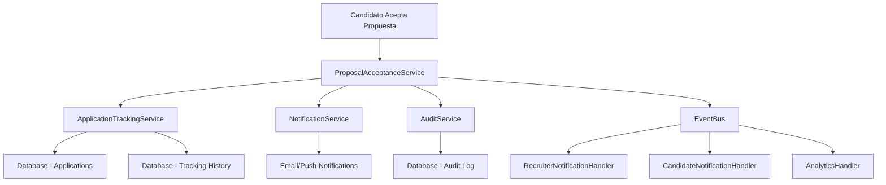

# Design Document - Integración Propuesta-Seguimiento

## Overview

Este diseño implementa la conexión automática entre la aceptación de propuestas laborales y el sistema de seguimiento del proceso de contratación. La solución se basa en un patrón de eventos que garantiza la consistencia de datos y proporciona trazabilidad completa del proceso.

## Architecture

### Patrón de Eventos y Servicios



### Flujo de Datos

1. **Evento de Aceptación**: Se dispara cuando el candidato acepta una propuesta
2. **Procesamiento Transaccional**: Todas las actualizaciones se realizan en una transacción
3. **Propagación de Eventos**: Se notifica a todos los servicios interesados
4. **Validación y Rollback**: Si algo falla, se revierte toda la operación

## Components and Interfaces

### 1. ProposalAcceptanceService

**Responsabilidad**: Orquestar el proceso de aceptación de propuestas

```typescript
interface ProposalAcceptanceService {
  acceptProposal(proposalId: string, candidateId: string, acceptanceData: AcceptanceData): Promise<AcceptanceResult>
  validateAcceptance(proposalId: string, candidateId: string): Promise<ValidationResult>
  rollbackAcceptance(acceptanceId: string): Promise<void>
}

interface AcceptanceData {
  acceptedAt: Date
  candidateNotes?: string
  negotiatedTerms?: NegotiatedTerms
}

interface AcceptanceResult {
  success: boolean
  acceptanceId: string
  updatedApplication: Application
  notifications: NotificationResult[]
  errors?: string[]
}
```

### 2. ApplicationTrackingService (Extendido)

**Responsabilidad**: Gestionar el seguimiento y estados de aplicaciones

```typescript
interface ApplicationTrackingService {
  // Métodos existentes...
  
  // Nuevos métodos para integración
  processOfferAcceptance(applicationId: string, offerDetails: OfferDetails): Promise<void>
  withdrawOtherApplications(candidateId: string, excludeApplicationId: string): Promise<void>
  createTrackingEntry(applicationId: string, event: TrackingEvent): Promise<void>
  getTrackingHistory(applicationId: string): Promise<TrackingEvent[]>
}

interface TrackingEvent {
  id: string
  applicationId: string
  eventType: 'offer_accepted' | 'status_changed' | 'stage_completed' | 'notification_sent'
  timestamp: Date
  details: Record<string, any>
  triggeredBy: 'system' | 'user' | 'recruiter'
  metadata?: Record<string, any>
}
```

### 3. NotificationService

**Responsabilidad**: Gestionar notificaciones a candidatos y reclutadores

```typescript
interface NotificationService {
  sendOfferAcceptanceNotification(
    recipientType: 'candidate' | 'recruiter',
    recipientId: string,
    notificationData: OfferAcceptanceNotificationData
  ): Promise<NotificationResult>
  
  scheduleFollowUpReminders(applicationId: string, nextStages: Stage[]): Promise<void>
  sendBulkNotifications(notifications: BulkNotificationRequest[]): Promise<NotificationResult[]>
}

interface OfferAcceptanceNotificationData {
  candidateName: string
  companyName: string
  positionTitle: string
  acceptanceDate: Date
  nextSteps: string[]
  offerDetails: OfferDetails
}
```

### 4. AuditService

**Responsabilidad**: Registrar auditoría y trazabilidad

```typescript
interface AuditService {
  logOfferAcceptance(auditData: OfferAcceptanceAudit): Promise<void>
  logStateChange(applicationId: string, fromState: ApplicationStatus, toState: ApplicationStatus, reason: string): Promise<void>
  getAuditTrail(applicationId: string): Promise<AuditEntry[]>
}

interface OfferAcceptanceAudit {
  acceptanceId: string
  candidateId: string
  applicationId: string
  offerId: string
  acceptedTerms: OfferDetails
  timestamp: Date
  ipAddress?: string
  userAgent?: string
}
```

## Data Models

### 1. Extensión del Modelo Application

```typescript
interface Application {
  // Campos existentes...
  
  // Nuevos campos para seguimiento
  acceptanceHistory?: AcceptanceHistoryEntry[]
  trackingEvents?: TrackingEvent[]
  exclusivityStatus?: 'none' | 'exclusive' | 'withdrawn'
  lastTrackingUpdate?: Date
}

interface AcceptanceHistoryEntry {
  id: string
  offerId: string
  acceptedAt: Date
  acceptedTerms: OfferDetails
  candidateNotes?: string
  status: 'active' | 'superseded' | 'cancelled'
}
```

### 2. Nuevo Modelo: ProcessTracking

```typescript
interface ProcessTracking {
  id: string
  applicationId: string
  candidateId: string
  companyId: string
  currentStage: string
  expectedCompletionDate?: Date
  milestones: Milestone[]
  automatedReminders: Reminder[]
  createdAt: Date
  updatedAt: Date
}

interface Milestone {
  id: string
  name: string
  description: string
  targetDate: Date
  completedDate?: Date
  status: 'pending' | 'in_progress' | 'completed' | 'overdue'
  assignedTo?: string
  dependencies?: string[]
}

interface Reminder {
  id: string
  type: 'email' | 'push' | 'sms'
  recipientId: string
  scheduledFor: Date
  message: string
  sent: boolean
  sentAt?: Date
}
```

## Error Handling

### 1. Estrategia de Transacciones

```typescript
class ProposalAcceptanceTransaction {
  private steps: TransactionStep[] = []
  
  async execute(): Promise<AcceptanceResult> {
    const transaction = await this.dataService.beginTransaction()
    
    try {
      // 1. Validar propuesta
      await this.validateProposal()
      
      // 2. Actualizar aplicación principal
      await this.updateMainApplication(transaction)
      
      // 3. Retirar otras aplicaciones
      await this.withdrawOtherApplications(transaction)
      
      // 4. Crear registros de seguimiento
      await this.createTrackingRecords(transaction)
      
      // 5. Registrar auditoría
      await this.logAuditTrail(transaction)
      
      await transaction.commit()
      
      // 6. Enviar notificaciones (fuera de transacción)
      await this.sendNotifications()
      
      return { success: true, ... }
      
    } catch (error) {
      await transaction.rollback()
      await this.handleError(error)
      throw error
    }
  }
}
```

### 2. Manejo de Fallos de Red

```typescript
class RetryableOperation {
  async executeWithRetry<T>(
    operation: () => Promise<T>,
    maxRetries: number = 3,
    backoffMs: number = 1000
  ): Promise<T> {
    for (let attempt = 1; attempt <= maxRetries; attempt++) {
      try {
        return await operation()
      } catch (error) {
        if (attempt === maxRetries || !this.isRetryableError(error)) {
          throw error
        }
        await this.delay(backoffMs * Math.pow(2, attempt - 1))
      }
    }
  }
}
```

## Testing Strategy

### 1. Pruebas Unitarias

- **ProposalAcceptanceService**: Validación de lógica de negocio
- **ApplicationTrackingService**: Actualización de estados y seguimiento
- **NotificationService**: Envío de notificaciones
- **AuditService**: Registro de auditoría

### 2. Pruebas de Integración

- **Flujo completo de aceptación**: Desde UI hasta base de datos
- **Manejo de errores**: Rollback y recuperación
- **Concurrencia**: Múltiples usuarios aceptando ofertas simultáneamente

### 3. Pruebas de Rendimiento

- **Carga de notificaciones**: Envío masivo de notificaciones
- **Transacciones concurrentes**: Múltiples aceptaciones simultáneas
- **Consultas de seguimiento**: Rendimiento de queries de historial

### 4. Pruebas de Modo Mock

```typescript
class MockProposalAcceptanceService implements ProposalAcceptanceService {
  async acceptProposal(proposalId: string, candidateId: string, acceptanceData: AcceptanceData): Promise<AcceptanceResult> {
    // Simular comportamiento sin afectar datos reales
    console.log(`📦 Mock: Propuesta ${proposalId} aceptada por candidato ${candidateId}`)
    
    return {
      success: true,
      acceptanceId: `mock-acceptance-${Date.now()}`,
      updatedApplication: this.createMockApplication(),
      notifications: this.createMockNotifications()
    }
  }
}
```

## Implementation Phases

### Fase 1: Core Integration (Semana 1)
- Implementar ProposalAcceptanceService básico
- Extender ApplicationTrackingService
- Crear modelos de datos necesarios
- Implementar transacciones básicas

### Fase 2: Notifications & Audit (Semana 2)
- Implementar NotificationService
- Implementar AuditService
- Crear sistema de eventos
- Agregar manejo de errores robusto

### Fase 3: UI Integration (Semana 3)
- Integrar con componentes de UI existentes
- Crear interfaces de seguimiento
- Implementar notificaciones en tiempo real
- Agregar validaciones de frontend

### Fase 4: Testing & Polish (Semana 4)
- Pruebas exhaustivas
- Optimización de rendimiento
- Documentación
- Deployment y monitoreo

## Security Considerations

### 1. Validación de Autorización

```typescript
class AuthorizationValidator {
  async validateOfferAcceptance(candidateId: string, offerId: string): Promise<boolean> {
    // Verificar que el candidato tiene derecho a aceptar esta oferta
    // Verificar que la oferta no ha expirado
    // Verificar que no hay conflictos de estado
    return true
  }
}
```

### 2. Auditoría de Seguridad

- Registrar IP y User-Agent en aceptaciones
- Detectar patrones sospechosos de aceptación
- Implementar rate limiting
- Validar integridad de datos críticos

## Monitoring and Analytics

### 1. Métricas Clave

- Tiempo promedio de procesamiento de aceptaciones
- Tasa de éxito de notificaciones
- Número de rollbacks por errores
- Tiempo de respuesta de queries de seguimiento

### 2. Alertas

- Fallos en transacciones de aceptación
- Errores en envío de notificaciones críticas
- Inconsistencias detectadas en auditoría
- Rendimiento degradado del sistema